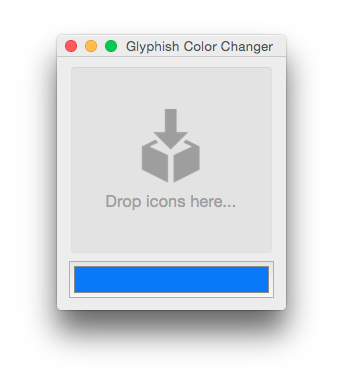

Glyphish Color Changer 
================

Easily change the color of your [Glyphish icons](http://glyphish.com/).



**Download the [latest releases and the latest stable release](https://github.com/glyphish/color-changer/releases).**

## Features

* Change the color of PNG icons.
* Change the color of SVG icons.
* Import multiple and mixed (SVG and PNG) icons at a time.

## Support
To resolve any issues you may be having, [open an issue](https://github.com/glyphish/color-changer/issues).  Any issues opened will be at least responded to within **24 hours**, and resolved as soon as possible!

## Changelog
#### Version 1.0
- Original project.

## Contributors

#### Version 1.0
Developed by [Rudd Fawcett](http://ruddfawcett.com). You can find all of his open source projects on [GitHub](https://github.com/ruddfawcett).

#### Glyphish Creator
Designed by [Joseph Wain](https://twitter.com/jpwain).  Visit Joseph's [personal site](http://www.penandthink.com), or peruse his [dribbble](https://dribbble.com/jpwain).

## Contributing

<p>1. Fork gallery to <code>username/color-changer</code>. <br/>
2. Clone the project:</p>

```
$ git clone https://github.com/{username}/color-changer
```

<p>3. Create your feature branch:</p>

````
$ git checkout -b my-new-feature
```

<p>4. Code your awesome feature idea. <br/>
5. Commit your changes:</p>

```
$ git commit -am 'Add some feature'
```

<p>6. Push to the branch:</p>

```
$ git push origin my-new-feature
```

<p>7. Create a new Pull Request to the <code>development</code> branch.</p>

If everything checks out, and we like your pull request, we'll merge it to `development`.  After merging some other branches to development (besides yours), we'll merge all of the new features to master, where they'll be part of the new release!

## Questions?

- Open an issue.


## Connect
- Follow [@Glyphish on Twitter](https://twitter.com/glyphish).
- Signup for [Glyphish news](https://confirmsubscription.com/h/r/7C4D8263FEF6DC79).
- Directly [contact Glyphish](https://helloglyphish.wufoo.com/forms/send-a-message-about-glyphish-icons/).
- Browse [available icon sets](http://www.glyphish.com).
